# R&D Cockpit · 研发驾驶舱

一个本地优先、以 **Daily Report 为主线** 的个人研发记录与项目情报系统。

它不会把 Git commit、Agent 工具调用或 Token 数量直接包装成“成果”。系统先保留人能读懂的日报，再用 Codex / Claude Code Session、Git、测试、实验和 Token 作为补充证据，生成项目发展、实验复盘、算法架构、知识汇总与趋势图。

> 本 README 中的项目、日期、指标和 Token 均为虚构的匿名演示数据，不包含维护者的真实日报、仓库路径或机器信息。

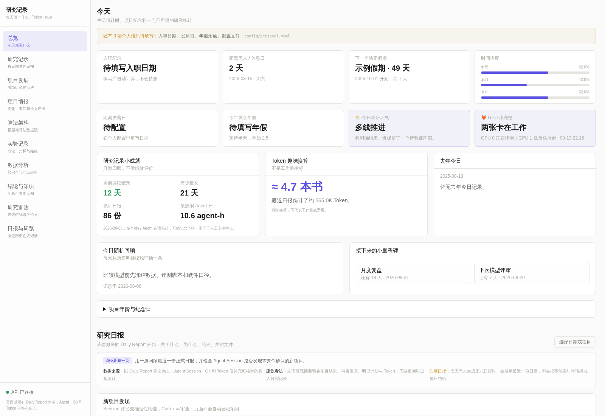

## 它解决什么问题

- 一天同时做多个项目，晚上想不起每个项目具体推进了什么；
- 一个 Agent Session 跨越多天，日报和 Token 难以按日期归属；
- 实验散落在 Codex、Claude Code、终端和仓库里，过一段时间无法复盘；
- 新 Agent 接手时需要重新阅读大量上下文；
- 只看到 commit、Session 和 Token，却看不到“为什么做、结果如何、形成了什么结论”；
- 项目有很多图表，但无法追溯数字来自哪份日报或哪条证据。

R&D Cockpit 的核心原则是：**自然语言内容来自正式日报及其审计结果；Git、Token 和 Agent 事件只负责补充统计与证据。**

## 数据如何流动

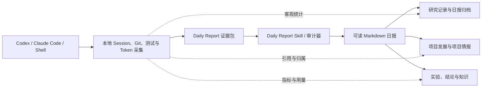

- **日报是主记录**：写清楚做了什么、为什么、结果、结论、关键文件和下一步。
- **采集器是证据层**：记录会话边界、命令结果、Git 状态和 Token 计数，不直接生成成果。
- **LLM 是可选分析器**：只在需要语义提炼时生成候选内容；结果必须引用给定证据并通过程序校验。
- **Dashboard 基本只读**：页面不负责维护任务卡，也不会在切换页面时临时调用模型。唯一写操作是给项目故事做本地语义纠错；论文检索、中文速读和其他语义提炼只在后台刷新。

## 主要功能

| 页面 | 它回答的问题 | 主要数据来源 |
| --- | --- | --- |
| 总览 | 今天做了什么，生活与研究状态如何？ | 最新日报、个人本地配置、客观统计 |
| 研究记录 | 某天或某个项目具体做了什么？ | 原始 Markdown 日报 |
| 项目发展 | 项目最近在做什么、得到什么、卡在哪里？ | 多日日报、Token、只读 GPU 快照 |
| 项目情报 | 上次查看后发生了什么，还有哪些未知？ | 经审计日报、项目投入统计 |
| 算法架构 | 当前算法如何设计，每个模型内部是什么？ | 源码、配置、评测、日报、经审阅公开资料 |
| 实验记录 | 实验问题、方法、指标、结论和证据是什么？ | 日报实验段落与证据审计 |
| 数据分析 | Token 和可读产出如何随日期、项目变化？ | 日报、Session 计数器差分 |
| 结论与知识 | 哪些内容值得跨天复用？ | 明确结论、决策和待验证假设 |
| 研究雷达 | 哪些新论文与当前项目真正相关、值得读？ | 项目主题、论文元数据、可选中文摘要 |
| 日报归档 | 如何回看历史正式日报？ | 日报目录 |

## 界面与功能截图

### 1. 总览：今天、生活栏与最新研究日报

把生活倒计时、记录连续天数、Token 趣味换算和最新正式日报放在同一入口。个人日期全部保存在忽略提交的本地配置中。


### 2. 研究记录：按日期或项目阅读原日报

保留“做了什么、为什么做、得到的结果、明确结论和关键文件”，不把底层事件流水直接扔给用户。

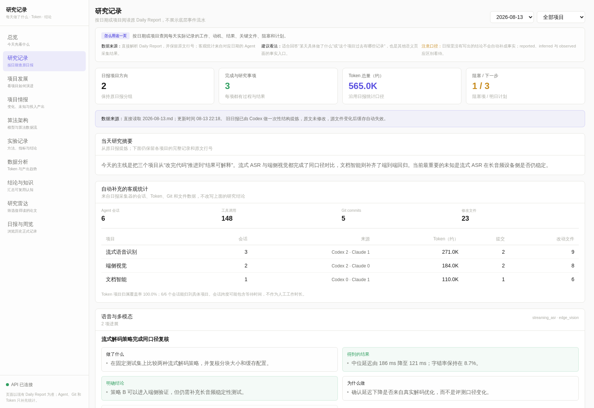

### 3. 项目发展：轨迹、阶段、指标与投入节奏

先给出一个项目当前在做什么、最近结果、阻塞与下一步，再用地铁图、研发星空、阶段分布和指标轨迹回看发展过程。首页先读取轻量摘要，选中项目后才加载该项目细节；全局知识图和历史快照按展开操作加载。

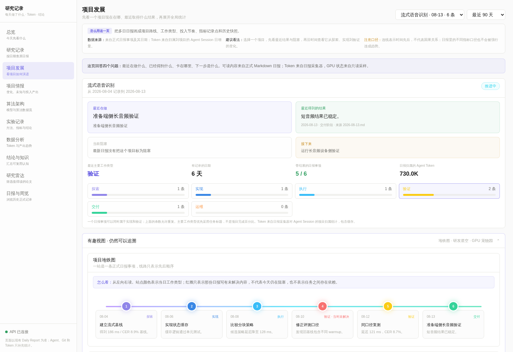

### 4. 项目情报：Project Pulse 与 Since Last Visit

用 Project Pulse 压缩项目近况；用 Since Last Visit、Open Unknowns、投入与有效进展、Breakthrough Timeline 和 Project Storyline 回答“哪里变了、还不知道什么”。

Project Storyline 下方可以标记“准确 / 没意义 / 内容错误 / 项目错误 / 有遗漏”。反馈只写入本地追加式账本，不会进入公开仓库，也不会被当作研究事实；下一次后台审计只重算反馈所引用的日报日期。新结果若缺少项目摘要、重复率过高或大量引用校验失败，会被质量闸门拒绝，页面继续显示明确标记的“上次可信版本”。

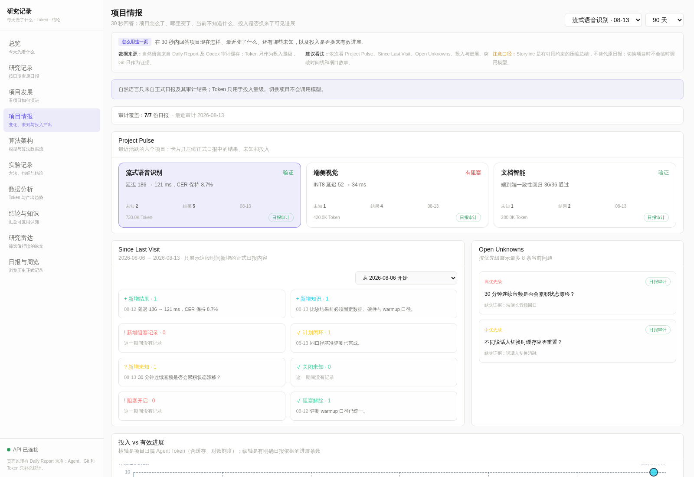

### 5. 算法架构：模型流水线与内部结构

从项目源码、配置、评测和正式日报提炼当前算法数据流。公开资料只能解释模型家族结构，不能冒充本地部署事实；未披露的闭源模型保持“不透明”。

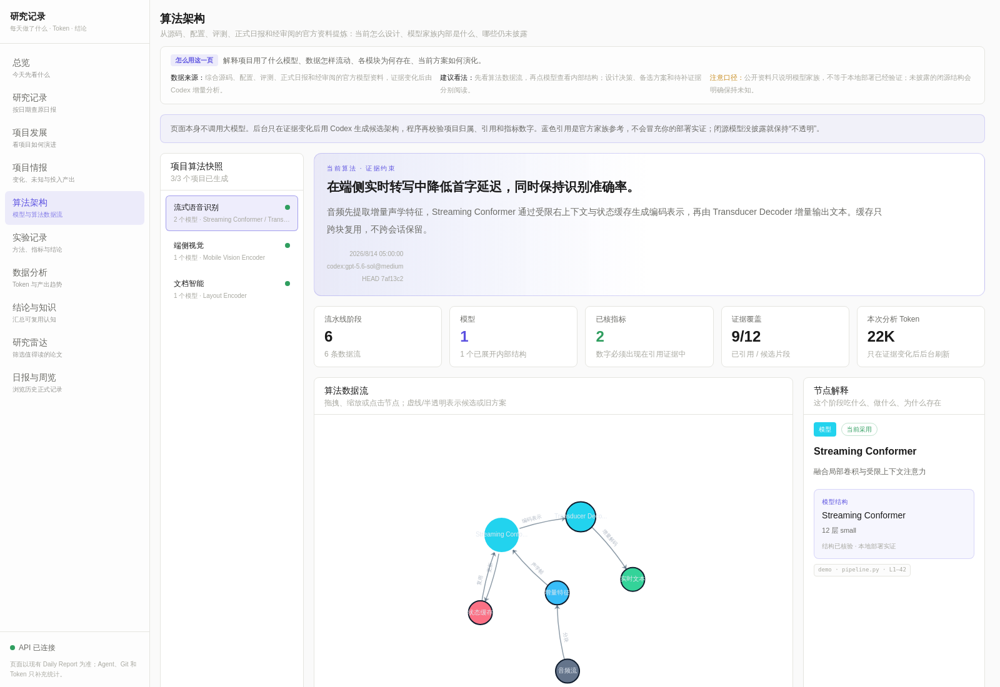

### 6. 实验记录：问题、方法、指标、结论和证据

只有日报中具备研究问题、验证方法和结果的内容才会进入实验页。相同项目、指标、单位和口径才能连成趋势，Token 只显示项目当日共享增量，不伪装成单次实验成本。

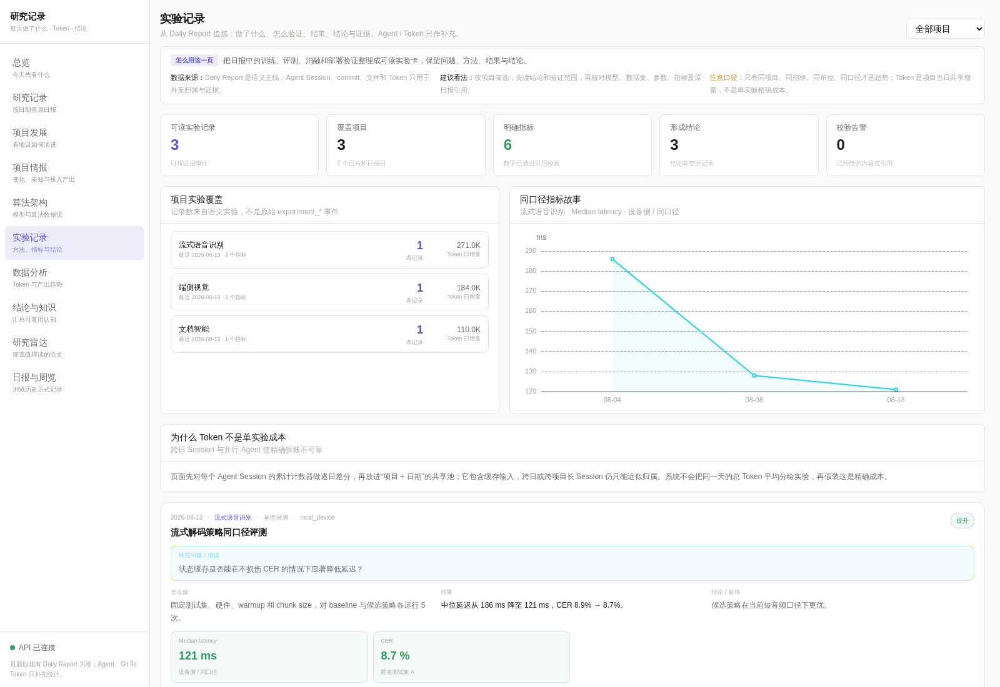

### 7. 数据分析：Token 与可读产出趋势

分别展示每天 Token、Codex / Claude Code 来源、项目归属，以及工作记录、实验和明确结论的变化。Token 只适合观察量级，不等于费用、工时或工作质量。

Codex / Claude Code 生命周期 Hook 另提供成功操作、失败操作、可观测执行耗时和涉及会话数的聚合视图。原始工具流水不会直接出现在页面，也不会被包装成成果。

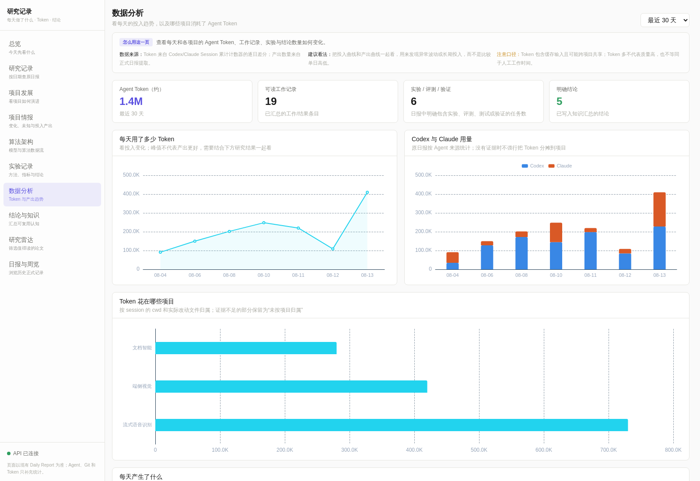

### 8. 结论与知识：可复用的研究认知

只汇总明确写出的研究结论、研究决策与待验证假设。构建成功、上传文件、测试通过等过程结果仍留在日报中，不冒充知识。

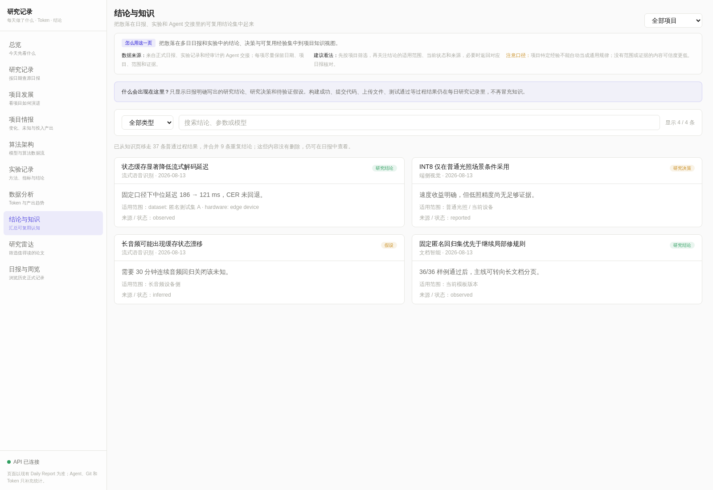

### 9. 研究雷达：项目相关论文与中文速读

按相关度、研究质量和实际价值筛选论文，默认只展示 A/B 级候选。中文摘要、关键点和“为什么值得读”帮助快速判断，英文原文和元数据可按需展开。页面只读取最近一次完整快照；检索或模型不可用时保留旧快照，不会让浏览请求等待或消耗 Token。

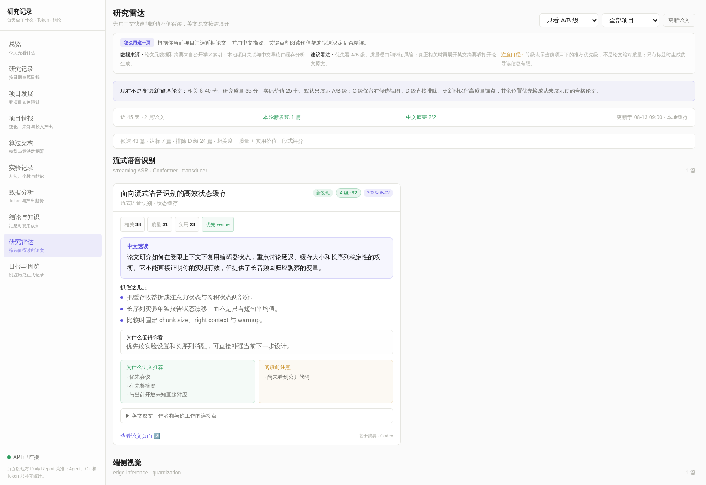

### 10. 日报归档：回看历史正式记录

直接浏览日报目录里的历史 Markdown，保留原始分组、结论、计划闭环、阻塞和 Token 口径。

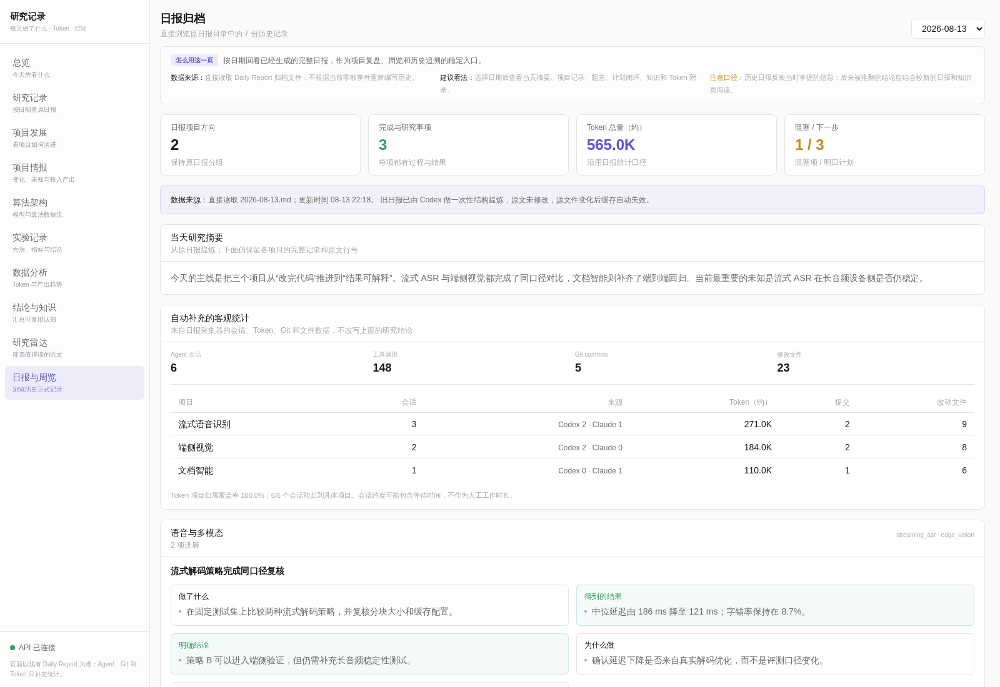

## 快速开始

环境要求：Python 3.10+、Node.js 20+、npm 和 Git。推荐安装 `uv`，但不是必需项。

```bash
git clone https://github.com/zhitao-zeng/rd-cockpit.git
cd rd-cockpit
./scripts/bootstrap.sh
```

登记一个项目：

```bash
.venv/bin/rd project add speech_research \
  --name "语音研究" \
  --repo "$HOME/code/speech-research" \
  --keyword ASR \
  --stage implementation \
  --stage local_eval \
  --stage delivery
```

启动本地页面：

```bash
./scripts/start.sh
```

打开 <http://127.0.0.1:4016>。开发脚本仍会在 `8787` 启动独立 API；长期运行模式会把同一套只读 API 合并到 `4016/api`，不再常驻一份重复后端。

首次初始化会生成 `config/projects.local.yaml`。它的权限为 `0600`，已被 Git 忽略；公开仓库中的 `config/projects.yaml` 只是匿名空模板。

如果需要长期运行，可以安装用户级服务和定时刷新：

```bash
./scripts/install-user-services.sh
```

安装脚本会先构建前端，再用一个 Python 进程同时提供静态页面和 `/api`，不会长期运行 Vite 开发服务器、文件监听器或重复 API。它会持续运行资源采样和增量 Token 同步，在每天 01:15（日报任务之后）刷新项目归类、实验提炼、算法架构和论文雷达，并预计算项目发展、项目情报和数据分析页面；每天 03:30 创建经过 SQLite 完整性校验的本地备份、增量归档低层历史事件、把 30 天前的高频 Agent 事件迁入可查询冷库，把 30 天前的 GPU 原始采样压缩为小时/日聚合，并清理过期或重复的派生视图缓存。首页的“后台资料更新”会显示每一步是正常、运行中还是失败。默认页面仍只监听 `127.0.0.1`；如需在可信局域网访问，可在安装时显式设置 `RD_WEB_HOST`，但请先阅读隐私说明。

当 `RD_WEB_HOST` 不是回环地址时，安装脚本会在私有的 `~/.config/rd-cockpit/env` 中生成 `RD_API_TOKEN`。浏览器首次打开会要求输入一次；生产 API 默认只开放页面使用的脱敏 `/api/simple/*` 接口，原始事件、Timeline、API 文档和绝对路径不会暴露。确需兼容旧接口时可显式设置 `RD_ENABLE_LEGACY_API=1`，但不建议在局域网模式使用。

备份、冷库、物化视图与归档都位于被 Git 忽略的 `.rd-cockpit/` 下。旧工具调用和旧 Token 事件先写入可校验的月归档及独立冷库，确认复制完整后才从热库移除；CLI 查询、证据和历史撤销会自动合并冷热两库。30 天前的 GPU 原始采样则在备份、归档并生成小时/日聚合后清理。需要额外保留独立的 `8787` API 时，可在安装命令前设置 `RD_ENABLE_STANDALONE_API=1`。

## 接入现有 Daily Report

默认从 `~/daily-reports` 读取日报，每份文件命名为 `YYYY-MM-DD.md`：

```markdown
# 日报 2026-01-15

## 语音研究

### 流式解码器评测
- **做了什么**：在固定测试集上比较两种解码策略。
- **为什么**：希望降低延迟，同时保持声学模型不变。
- **结果**：策略 B 的中位延迟更低；远端验证尚未完成。
- **明确结论**：策略 B 可以进入设备侧验证，当前不能宣称已完成交付。
- **关键文件**：`results/streaming-eval.json`
```

要使用其他目录，只需设置：

```bash
export RD_DAILY_REPORT_DIR="$HOME/research-reports"
```

历史结构化提炼会写入日报旁边被忽略的 sidecar 缓存，**不会改写原始 Markdown**。源文件变化后缓存自动失效。

用户可见项目只来自 `projects.local.yaml` 的登记表。旧日报里的历史别名可以通过 `legacy_project_ids` 或顶层 `project_aliases` 映射；无法确认的标签统一进入“未登记历史记录”，不会自动长成一个新项目。

## Daily Report Skill

仓库内置了可审查、可修改的 [`daily-report` Skill](skills/daily-report/SKILL.md)。它从受限的本地 Session 摘要、已登记仓库、测试与 Git 证据以及昨日计划生成候选日报，然后通过校验器拒绝无证据的完成状态、数字和引用。

安装到 Codex 和 Claude Code：

```bash
./scripts/install-skill.sh --all
```

之后可以调用 `$daily-report`，或直接说“生成今天的日报”。安装 Skill 不会创建定时任务，也不会自行向外部服务发送数据。

## Agent 生命周期与自动采集

确认命令内容后，可以安装本地生命周期 Hook：

```bash
.venv/bin/rd install-hooks
```

Hook 记录 Session 开始/结束和结构化命令结果，识别测试、benchmark、训练与评测。普通成功工具调用只累加到按天、项目和 Session 聚合的活动统计，不再制造一长串低价值事件；失败、实验和验证仍保留可追溯记录。它不会复制完整 prompt、完整模型回复或终端录像。SQLite 暂时繁忙时，Hook 会快速写入脱敏队列，避免阻塞 Agent 退出。详情见 [hooks/README.md](hooks/README.md)。

常用命令：

```bash
.venv/bin/rd status
.venv/bin/rd resume speech_research
.venv/bin/rd run --project speech_research --type test -- pytest -q
.venv/bin/rd daily
.venv/bin/rd weekly
.venv/bin/rd since "yesterday"
.venv/bin/rd project discover --days 30
.venv/bin/rd algorithm-analyze speech_research
.venv/bin/rd experiment-backfill --days 90 --project speech_research
.venv/bin/rd radar-refresh
.venv/bin/rd doctor
```

## LLM 使用方式

所有确定性页面都可以在没有 API Key 的情况下工作。需要语义能力的功能包括：旧日报结构提炼、项目情报审计、实验提炼、算法架构候选和论文中文速读。

- 模型只读取为当前任务构造的有界证据包；
- 输出使用结构化 JSON，并要求引用允许的证据 ID；
- 程序再次校验项目归属、引用、数字和状态；
- 项目情报还会检查可读摘要覆盖率、被移除候选数量和重复率；不合格批次不会覆盖上一次可信结果；
- 页面纠错以本地反馈事件保存，只使其引用日期的语义缓存失效；用户意见用于审计改进，不能代替日报证据；
- 语义结果同时绑定源内容哈希、输出 Schema、Prompt 版本、模型策略和项目目录；任何一项变化都会使旧缓存失效；
- `rd semantic-eval` 可离线运行覆盖多项目归属、计划冒充结果、数字/版本篡改和无活动判断的 golden 回归；
- 算法架构只比较实际送入分析器的代码、配置与日报片段；普通 commit、分支或无关段落变化不会使缓存失效；
- 夜间架构刷新默认最多调用 4 次模型，剩余项目自动延后到下一轮；
- 首页显示最近 24 小时实际模型调用、缓存命中、延后数量和 Token；`/api/simple/model-runs` 提供不含 prompt/输出的调用账单；
- 模型不可用时，确定性视图仍可使用，语义视图显示保守回退或缓存状态。

Agent Token 同步使用一张“当前会话”状态表原地更新。只有会话静默、跨日或切换项目时才向事实账本追加一条结算记录，避免每五分钟保存一份累计计数器快照。

## 性能与健康检查

日报仍是唯一事实来源，但系统会在私有的 `.rd-cockpit/report-facts.json` 中保存按内容指纹增量更新的解析快照。日报、审计 sidecar 或用量补充没有变化时，多张页面直接复用同一份事实；项目公共配置变化时则安全地全量重建。项目发展使用摘要、单项目、全局视图和分页历史接口，避免首屏下载完整关系图与所有历史。

运行只读体检：

```bash
.venv/bin/rd doctor
```

它会检查配置、SQLite 完整性和 schema、日报事实快照、物化视图、语义缓存、Hook 队列、前端构建、用户服务，并把最新备份恢复到临时目录做一次真实演练。不会修改原数据库或停止资源。

CI 同时执行后端测试、前端测试与构建、语义 golden 回归、固定规模投影性能门禁以及包含 Git 历史的隐私扫描。

可选配置见 [.env.example](.env.example)：

```bash
export RD_LLM_BASE_URL="http://127.0.0.1:4000/v1"
export RD_LLM_API_KEY="..."
export RD_LLM_MODEL="your-model"
export RD_LLM_FALLBACK_MODEL="your-fallback-model"
export RD_VIEW_CACHE_RETENTION_DAYS=14
export RD_VIEW_CACHE_MAX_MB=100
```

不要把密钥写进仓库。

## 本地配置

私有本地文件会覆盖公开匿名模板：

| 本地文件 | 用途 |
| --- | --- |
| `config/projects.local.yaml` | 仓库、匹配规则、验证阶段和研究主题 |
| `config/personal.yaml` | 可选的入职日期、发薪日、假期和年假余额 |
| `config/model-evidence.local.yaml` | 已审阅的模型家族公开资料 |
| `config/project-research-briefs.local.yaml` | 人工复核的项目研究精读 |

示例位于 `config/*.example.yaml`。

## 隐私与安全

数据库、日报、Session 缓存、归档、本地配置和凭证默认不进入 Git。公开 fork 前建议运行：

```bash
./scripts/privacy-check.sh --history
```

启用外部模型或把服务暴露到局域网前，请先阅读 [PRIVACY.md](PRIVACY.md)。回环地址保持零配置；绑定局域网地址时，安装器会启用 Bearer Token、关闭 API 文档与原始事件接口，并对页面 JSON 再做路径、机器、Session 和内网地址脱敏。HTTP Token 不能替代不可信网络上的 TLS；跨网段或公网访问仍应放在 HTTPS 反向代理后。

## 开发与验证

```bash
.venv/bin/pytest
npm --prefix frontend test
npm --prefix frontend run build
./scripts/privacy-check.sh
```

## License

[MIT](LICENSE)
